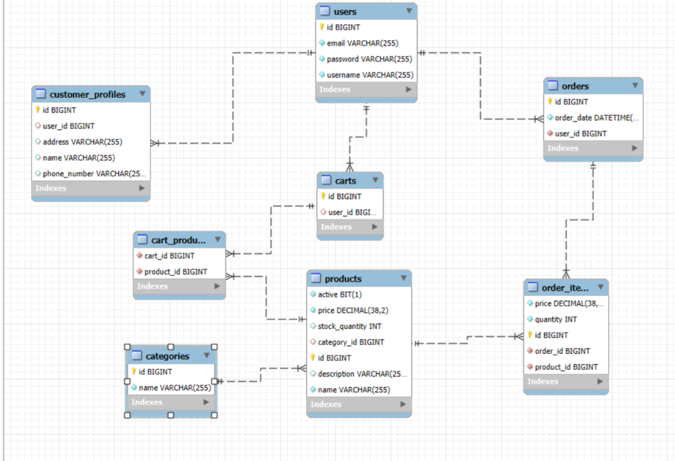

# E-commerce Data Access Layer (DAL)

## Project Overview

This project is a robust Data Access Layer (DAL) for an E-commerce platform, built using Spring Boot and Java. It serves as the backbone for managing the core entities of an e-commerce system, exposing a comprehensive set of RESTful APIs to interact with the database. The application is designed to handle common e-commerce operations, including user management, product cataloging, cart operations, and order processing.

### Key Functionality

1. **User Management**: Allows creation and management of user accounts and their associated customer profiles. Supports searching and pagination.
2. **Category and Product Catalog**: Enables categorization of products. Provides APIs to add products with pricing, stock quantity, and descriptions, linking them to specific categories.
3. **Cart Operations**: Users can add multiple products to their shopping carts. The system manages the many-to-many relationship between carts and products.
4. **Order Processing**: Facilitates the creation of orders with specific product quantities. It calculates details and manages the lifecycle of order items linked to a user.
5. **Pagination and Sorting**: All major endpoints support pagination and dynamic sorting by field and direction (ascending/descending), ensuring optimal performance for large datasets.
6. **Search Capabilities**: Dedicated search endpoints are provided to find users by email, username, or general queries, as well as searching products and categories by name.

## Database Schema

Please refer to the following Entity-Relationship diagram for the database architecture used in this project:



*Note: Ensure that the schema image is named `database_schema.png` and placed in the root of the repository for it to render correctly on GitHub.*

## Live Deployment

The application is deployed live on Render and can be accessed using the following base URL:

**`https://ecommerce-dal.onrender.com`**

### Testing the Live API

You can test the live endpoints directly in your browser or using tools like Postman/cURL. Note that there is no root page (`/`), so you must visit specific endpoints to see data. 

**Example Working Endpoints:**
- View all Users: [https://ecommerce-dal.onrender.com/users](https://ecommerce-dal.onrender.com/users)
- View all Products: [https://ecommerce-dal.onrender.com/products](https://ecommerce-dal.onrender.com/products)
- View all Categories: [https://ecommerce-dal.onrender.com/categories](https://ecommerce-dal.onrender.com/categories)
- Sort Users: [https://ecommerce-dal.onrender.com/users/sort](https://ecommerce-dal.onrender.com/users/sort)

## API Endpoints Documentation

Below is the complete list of REST API endpoints exposed by this application. For POST and PUT methods, the required raw JSON request bodies are provided. All endpoints can be appended to the live base URL above.

### 1. Users API

Base Path: `https://ecommerce-dal.onrender.com/users`

*   **GET** `https://ecommerce-dal.onrender.com/users`
    *   Description: Retrieves a paginated list of users.
    *   Query Parameters: `page` (default: 0), `size` (default: 5)
*   **GET** `https://ecommerce-dal.onrender.com/users/sort`
    *   Description: Retrieves a sorted and paginated list of users.
    *   Query Parameters: `page` (default: 0), `size` (default: 5), `field` (default: "id"), `direction` (default: "asc")
*   **GET** `https://ecommerce-dal.onrender.com/users/{id}`
    *   Description: Retrieves a specific user by their ID.
*   **GET** `https://ecommerce-dal.onrender.com/users/search`
    *   Description: Searches users using a query string.
    *   Query Parameters: `query`
*   **GET** `https://ecommerce-dal.onrender.com/users/search/username`
    *   Description: Finds a user by their username.
    *   Query Parameters: `username`
*   **GET** `https://ecommerce-dal.onrender.com/users/search/email`
    *   Description: Finds a user by their email.
    *   Query Parameters: `email`
*   **DELETE** `https://ecommerce-dal.onrender.com/users/{id}`
    *   Description: Deletes a user by their ID.

*   **POST** `https://ecommerce-dal.onrender.com/users`
    *   Description: Creates a new user.
    *   Request Body (Raw JSON):
        ```json
        {
          "username": "govinddangi",
          "password": "securepassword123",
          "email": "govind@example.com"
        }
        ```

*   **PUT** `https://ecommerce-dal.onrender.com/users/{id}`
    *   Description: Updates an existing user's information.
    *   Request Body (Raw JSON):
        ```json
        {
          "username": "govinddangi_updated",
          "email": "govind.updated@example.com",
          "name": "Govind Dangi",
          "address": "123 Main St, City, Country"
        }
        ```

### 2. Categories API

Base Path: `https://ecommerce-dal.onrender.com/categories`

*   **GET** `https://ecommerce-dal.onrender.com/categories`
    *   Description: Retrieves a paginated list of categories.
    *   Query Parameters: `page` (default: 0), `size` (default: 5)
*   **GET** `https://ecommerce-dal.onrender.com/categories/sort`
    *   Description: Retrieves a sorted and paginated list of categories.
    *   Query Parameters: `page` (default: 0), `size` (default: 5), `field` (default: "id"), `direction` (default: "asc")
*   **GET** `https://ecommerce-dal.onrender.com/categories/{id}`
    *   Description: Retrieves a specific category by its ID.
*   **GET** `https://ecommerce-dal.onrender.com/categories/search`
    *   Description: Searches for a category by its name.
    *   Query Parameters: `name`
*   **DELETE** `https://ecommerce-dal.onrender.com/categories/{id}`
    *   Description: Deletes a category by its ID.

*   **POST** `https://ecommerce-dal.onrender.com/categories`
    *   Description: Creates a new category.
    *   Request Body (Raw JSON):
        ```json
        {
          "name": "Electronics"
        }
        ```

*   **PUT** `https://ecommerce-dal.onrender.com/categories/{id}`
    *   Description: Updates an existing category.
    *   Request Body (Raw JSON):
        ```json
        {
          "name": "Home Appliances"
        }
        ```

### 3. Products API

Base Path: `https://ecommerce-dal.onrender.com/products`

*   **GET** `https://ecommerce-dal.onrender.com/products`
    *   Description: Retrieves a paginated list of products.
    *   Query Parameters: `page` (default: 0), `size` (default: 5)
*   **GET** `https://ecommerce-dal.onrender.com/products/sort`
    *   Description: Retrieves a sorted and paginated list of products.
    *   Query Parameters: `page` (default: 0), `size` (default: 5), `field` (default: "id"), `direction` (default: "asc")
*   **GET** `https://ecommerce-dal.onrender.com/products/{id}`
    *   Description: Retrieves a specific product by its ID.
*   **GET** `https://ecommerce-dal.onrender.com/products/search`
    *   Description: Searches for a product by its name.
    *   Query Parameters: `name`
*   **DELETE** `https://ecommerce-dal.onrender.com/products/{id}`
    *   Description: Deletes a product by its ID.

*   **POST** `https://ecommerce-dal.onrender.com/products`
    *   Description: Adds a new product and links it to a category.
    *   Request Body (Raw JSON):
        ```json
        {
          "name": "Smartphone XYZ",
          "description": "Latest 5G smartphone with advanced features.",
          "price": 699.99,
          "stockQuantity": 50,
          "categoryId": 1
        }
        ```

*   **PUT** `https://ecommerce-dal.onrender.com/products/{id}`
    *   Description: Updates an existing product's details.
    *   Request Body (Raw JSON):
        ```json
        {
          "name": "Smartphone XYZ Pro",
          "description": "Updated model with better camera.",
          "price": 749.99,
          "stockQuantity": 45
        }
        ```

### 4. Orders API

Base Path: `https://ecommerce-dal.onrender.com/orders`

*   **GET** `https://ecommerce-dal.onrender.com/orders`
    *   Description: Retrieves a paginated list of orders.
    *   Query Parameters: `page` (default: 0), `size` (default: 5)
*   **GET** `https://ecommerce-dal.onrender.com/orders/sort`
    *   Description: Retrieves a sorted and paginated list of orders.
    *   Query Parameters: `page` (default: 0), `size` (default: 5), `field` (default: "id"), `direction` (default: "asc")
*   **GET** `https://ecommerce-dal.onrender.com/orders/{id}`
    *   Description: Retrieves a specific order by its ID.
*   **DELETE** `https://ecommerce-dal.onrender.com/orders/{id}`
    *   Description: Deletes an order by its ID.

*   **POST** `https://ecommerce-dal.onrender.com/orders`
    *   Description: Creates a new order for a user with multiple products and their specific quantities.
    *   Request Body (Raw JSON):
        ```json
        {
          "userId": 1,
          "productQuantities": {
            "2": 1,
            "5": 3
          }
        }
        ```
        *(In `productQuantities`, the key is the Product ID, and the value is the quantity ordered).*

*   **PUT** `https://ecommerce-dal.onrender.com/orders/{id}`
    *   Description: Updates the user ID associated with an order.
    *   Request Body (Raw JSON):
        ```json
        {
          "useriId": 2
        }
        ```

### 5. Carts API

Base Path: `https://ecommerce-dal.onrender.com/carts`

*   **GET** `https://ecommerce-dal.onrender.com/carts`
    *   Description: Retrieves a paginated list of shopping carts.
    *   Query Parameters: `page` (default: 0), `size` (default: 5)
*   **GET** `https://ecommerce-dal.onrender.com/carts/sort`
    *   Description: Retrieves a sorted and paginated list of shopping carts.
    *   Query Parameters: `page` (default: 0), `size` (default: 5), `field` (default: "id"), `direction` (default: "asc")
*   **GET** `https://ecommerce-dal.onrender.com/carts/{id}`
    *   Description: Retrieves a specific cart by its ID.
*   **DELETE** `https://ecommerce-dal.onrender.com/carts/{id}`
    *   Description: Deletes a cart by its ID.

*   **POST** `https://ecommerce-dal.onrender.com/carts`
    *   Description: Creates a new cart for a user containing a list of products.
    *   Request Body (Raw JSON):
        ```json
        {
          "userId": 1,
          "productIds": [2, 4, 7]
        }
        ```

*   **PUT** `https://ecommerce-dal.onrender.com/carts/{id}`
    *   Description: Updates cart references.
    *   Request Body (Raw JSON):
        ```json
        {
          "id": 15
        }
        ```
